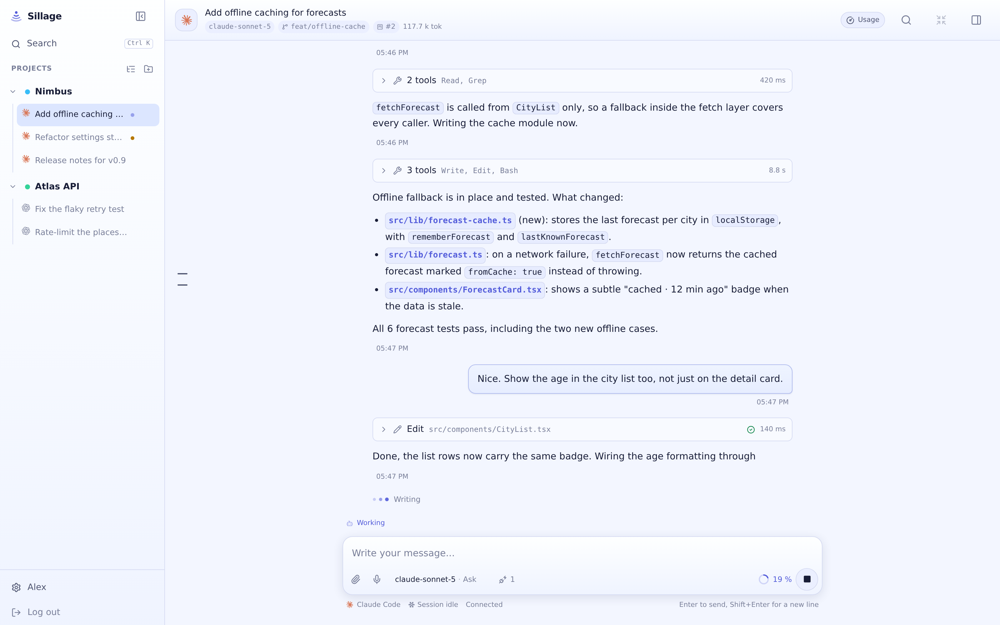

[](https://github.com/MarlBurroW/sillage/releases/latest)
[](https://github.com/MarlBurroW/sillage/actions/workflows/ci.yml)
[](LICENSE)

A self-hosted, mobile-first web UI that drives the native Claude Code and Codex
CLIs on your own machine. Vibe-code from anywhere: the official agent harnesses,
without the terminal.

Website: [marlburrow.github.io/sillage](https://marlburrow.github.io/sillage)

<picture>
  <source srcset="site/screenshots/hero-dark.png" media="(prefers-color-scheme: dark)">
  
</picture>

## Why

Coding agents work best inside the harness their vendor ships: its prompts, its
tools, its permission flow. Rewriting that inside a web app gets you a worse agent
behind a nicer interface. So Sillage drives the native CLIs and replaces the one
part that does not travel, the terminal.

Sillage is built with AI, heavily. Claude Code and Codex wrote most of the code,
and most of that happened from inside Sillage itself.

The full specification lives in [docs/SPEC.md](docs/SPEC.md) (French).

## What it adds on top of the CLIs

- **Sessions that outlive the client.** The event journal on the server is the
  source of truth, not the browser: close the laptop mid-turn and reopen on a
  phone, the agent kept working and the thread replays as it happened.
- **A queue, and steering.** Write while a turn runs. The message waits on the
  server and can be withdrawn, or goes straight into the turn already in flight.
- **One grammar for both CLIs.** Claude Code and Codex are translated into a
  single event schema, so history, search, the board and the panel behave the
  same way whichever one ran the conversation.
- **The repository, one panel away.** File explorer, editor, diffs, commit
  history and terminals, beside the conversation that changed them.
- **Worktrees.** Start a conversation on the project root, on an existing
  worktree, or on a branch Sillage creates for it.
- **Full-text search** across every conversation in every project.
- **A board the agents can read.** Cards per project, handed to the agent through
  a built-in MCP server: a session can read its card, look up what an earlier one
  decided, see which sessions are running, and leave a note for the next.
- **Installable PWA with push notifications**, silent while you already have the
  conversation open.
- **Dictation** biased with a lexicon read from the project itself plus the
  current branch, then an optional cleanup pass. Any OpenAI-format endpoint.
- **MCP servers** declared once and handed to the agents that should get them.
- **A task API for machines.** `/api/v1` speaks tasks rather than screens: open
  one in a project, follow its events, answer what it asks, steer or interrupt
  it, and take a webhook when it lands. Bearer tokens carry their own scopes and
  an optional list of allowed projects, separate from the browser session.

## Install

### Docker

The agent CLIs are not in the image: install the ones you use from the UI and
they land in the data volume. Mount your credential directories to reuse the
authentication done on the host, and your projects:

```bash
curl -fsSLO https://raw.githubusercontent.com/MarlBurroW/sillage/main/deploy/docker-compose.example.yml
mv docker-compose.example.yml docker-compose.yml   # then adjust the mounted paths
docker compose up -d
docker compose exec -it sillage node /app/server/cli/user-create.js   # first account, admin
```

Update by pulling a newer image tag. The UI tells you when a release is available
and what changed.

### One-line script (Linux, no Docker)

Requires Linux x64/arm64, systemd and Node.js 22+. The agent CLIs are optional
here too: Sillage installs the ones you want from the UI, you authenticate them
yourself.

```bash
curl -fsSL https://raw.githubusercontent.com/MarlBurroW/sillage/main/install.sh | bash
```

This installs under `~/.local/share/sillage`, sets up a systemd user service and
creates the first account. Later updates happen from the web UI (Settings > About)
or by re-running the script. Remember `loginctl enable-linger $USER` so the
service survives logout.

### From source (development)

Requires Node 22+ and pnpm 9, plus at least one agent CLI, from the host or
installed from the UI:

```bash
pnpm install
pnpm db:generate          # only after changing packages/db/src/schema.ts
pnpm user:create          # first account, admin
pnpm dev                  # API on :7317, Vite UI on :5317 with /api proxy
```

## Security model

Sillage is built for a trusted circle, not for public exposure:

- Agents run under your system account, with your Claude and Codex credentials.
  Every account on the instance shares your subscriptions.
- Terminal mode gives a full shell under that same account.
- There is no system-level isolation between users: a shared project is readable
  by every account.

The server listens on `127.0.0.1` by default and does not terminate TLS. To reach
it remotely, go through a reverse proxy (Caddy) or a tunnel (Tailscale, Cloudflare
Tunnel). Never expose it directly to the Internet.

## Releases

Releases are git tags (`vX.Y.Z`). Each tag builds Linux tarballs (x64 and arm64,
prebuilt native modules included), a multi-arch Docker image on
`ghcr.io/marlburrow/sillage`, and a GitHub release with generated notes. The app
shows the installed version, checks for newer releases, and on installer-based
setups can update itself from the UI.

## Repository layout

```
apps/server       Fastify daemon: API, WebSocket, CLI supervision
apps/web          React UI, PWA
packages/protocol shared event schema and types
packages/db       Drizzle schema and migrations
deploy/           systemd unit template, config example, docker-compose example
site/             one-page website (GitHub Pages) and its screenshots
scripts/          screenshot runner, runtime staging, Codex type generation
docs/brand/       the brand and the files derived from it
```

## License

MIT, see [LICENSE](LICENSE).
