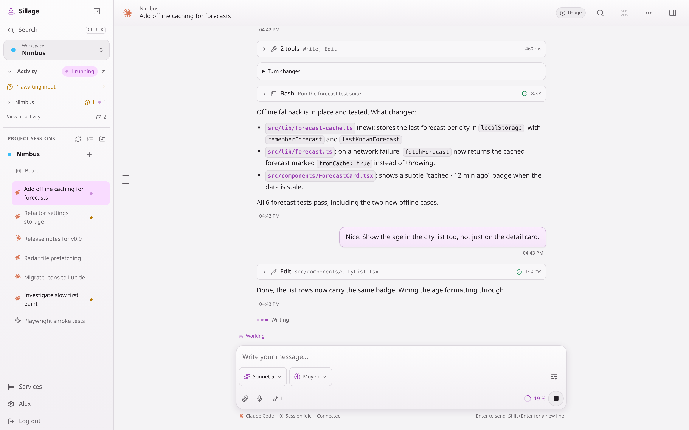

[](https://github.com/MarlBurroW/sillage/releases/latest)
[](https://github.com/MarlBurroW/sillage/actions/workflows/ci.yml)
[](LICENSE)

A self-hosted, mobile-first web UI that drives the native Claude Code, Codex and
OpenCode CLIs on your own machine. Vibe-code from anywhere: the official agent harnesses,
without the terminal.

Runs on Linux, on macOS (Apple Silicon), on Windows through WSL2, in Docker or on
Kubernetes. An always-on server is recommended for continuity across devices; a
workstation works too while it stays awake and online.
[Set up private remote access and agent preview links](docs/remote-access.md).

Website: [marlburrow.github.io/sillage](https://marlburrow.github.io/sillage)

<picture>
  <source srcset="site/screenshots/hero-dark.png" media="(prefers-color-scheme: dark)">
  
</picture>

## Why

Coding agents work best inside the harness their vendor ships: its prompts, its
tools, its permission flow. Rewriting that inside a web app gets you a worse agent
behind a nicer interface. So Sillage drives the native CLIs and replaces the one
part that does not travel, the terminal.

Sillage is built with AI, heavily. Claude Code and Codex wrote most of the code,
and most of that happened from inside Sillage itself.

The full specification lives in [docs/SPEC.md](docs/SPEC.md) (French).

## What it adds on top of the CLIs

- **Sessions that outlive the client.** The event journal on the server is the
  source of truth, not the browser: close the browser mid-turn and reopen on a
  phone through your configured remote connection. While the host stays awake and
  Sillage is running, the agent keeps working and the thread replays as it happened.
- **A queue, and steering.** Write while a turn runs. The message waits on the
  server and can be withdrawn, or goes straight into the turn already in flight.
- **One grammar for every CLI.** Claude Code, Codex and OpenCode are translated
  into a single event schema, so history, search, the board and the panel behave the
  same way whichever one ran the conversation.
- **The repository, one panel away.** File explorer, editor, diffs, commit
  history and terminals, beside the conversation that changed them.
- **Worktrees.** Start a conversation on the project root, on an existing
  worktree, or on a branch Sillage creates for it.
- **Full-text search** across every conversation in every project.
- **Processes launched by Sillage.** On Linux, see commands and services still
  attached to Sillage, their parent, ports and originating conversation. Independent
  systemd services and tmux sessions are excluded. [Detection and limits](docs/services.md).
- **A board the agents can read and add to.** Cards per project, handed to the
  agent through a built-in MCP server: a session can read its card, look up what an
  earlier one decided, see which sessions are running, and leave a note for the
  next. It can also open a card for a bug it ran into along the way. Moving cards
  and editing their descriptions stay with you.
- **Sessions that coordinate.** Through the same server, a session can message
  another, ask to be notified when it finishes, or start a new one when you ask:
  "start a Codex session at max effort to fix this" opens a conversation that you
  can follow like any other, with its own CLI, model, effort and worktree. The new
  session starts with the project's default permissions.
- **Shared instructions and memory.** One `SILLAGE.md` and one project memory for
  all three CLIs, editable from the interface, which agents can read and rewrite.
  [How it works](#instructions-and-memory).
- **Installable PWA with push notifications**, silent while you already have the
  conversation open.
- **Dictation** biased with a lexicon read from the project itself plus the
  current branch, then an optional cleanup pass. Any OpenAI-format endpoint.
- **MCP servers** declared once and handed to the agents that should get them.
- **A task API for machines.** `/api/v1` speaks tasks rather than screens: open
  one in a project, follow its events, answer what it asks, steer or interrupt
  it, and take a webhook when it lands. Bearer tokens carry their own scopes and
  an optional list of allowed projects, separate from the browser session.

## Instructions and memory

Each CLI keeps its own context files: Claude Code reads `CLAUDE.md` and its auto
memory under `~/.claude`, Codex reads `AGENTS.md`, OpenCode reads `AGENTS.md` or
`CLAUDE.md`. Sillage gives all three the same two things instead.

|  | Instructions (`SILLAGE.md`) | Memory |
| --- | --- | --- |
| What it holds | Rules you set: conventions, preferences, things to avoid | What agents learned while working: decisions, pitfalls, facts |
| Scope | One global part, one part per project | One per project, shared by all its worktrees |
| Who writes | You, in the interface; agents when you ask them | Agents, on their own; you can fix or delete notes |
| Claude Code | Appended to its system prompt | Its native auto memory, pointed at Sillage's folder (`autoMemoryDirectory`) |
| Codex | Added to its developer instructions | The index is given at startup; it reads notes from the folder and writes through MCP tools |
| OpenCode | Sent as the system prompt of each message | The index comes with each message; it reads notes from the folder and writes through MCP tools |
| Agent tools | `read_instructions` · `edit_instructions` · `write_instructions` | `read_memory` · `write_memory` · `delete_memory` |
| Edited from | Settings › Instructions (global), the project page, the conversation header | The project page |

**Where a project's instructions live** is chosen when the project is created, and
can be changed later:

- *In Sillage*: kept in Sillage and given to every CLI. The repository's `CLAUDE.md`
  and `AGENTS.md` are hidden from agents (`claudeMdExcludes` for Claude Code,
  `project_doc_max_bytes = 0` for Codex, `OPENCODE_DISABLE_PROJECT_CONFIG` for
  OpenCode) so nothing arrives twice. The files themselves are not touched.
  OpenCode has no finer switch: its project `opencode.json` and `.opencode/` folder
  are skipped too.
- *In the repository*: the project part is the workspace's `AGENTS.md` (or
  `CLAUDE.md`), which the CLIs read on their own; the interface edits that file.
  Only the global part comes from Sillage.

By default, a project whose folder already has one of those files stays on the
repository; existing projects keep working as before. Their instructions panel offers
to move the files' content into Sillage in one step.

**Memory** is the format Claude Code already uses: a `MEMORY.md` index and one note per
file, under `<data>/memory/projects/<id>`. On first launch, the memory Claude kept for
the project root is copied there; the original stays in place.

**When changes apply.** Claude Code and Codex read both when a session starts. A
session already running keeps what it received: Claude Code records its system
prompt on the first turn and replays it on resume, until the next compaction.
OpenCode receives them with every message, so an edit reaches it on the next one.

Details and the probes behind them: [docs/sillage-md.md](docs/sillage-md.md).

## Install

### Docker

The agent CLIs are not in the image: install the ones you use from the UI and
they land in the data volume. Mount your credential directories to reuse the
authentication done on the host, and your projects:

```bash
curl -fsSLO https://raw.githubusercontent.com/MarlBurroW/sillage/main/deploy/docker-compose.example.yml
mv docker-compose.example.yml docker-compose.yml   # then adjust the mounted paths
docker compose up -d
docker compose exec -it sillage node /app/server/cli/user-create.js   # first account, admin
```

Update by pulling a newer image tag. The UI tells you when a release is available
and what changed.

### Kubernetes (Helm)

A chart lives in [`deploy/helm/sillage`](deploy/helm/sillage), built on the same
image and the same volumes as the Compose setup.

```bash
helm install sillage ./deploy/helm/sillage \
  --namespace sillage --create-namespace \
  --set storage.data.storageClass=<a-block-storage-class> \
  --set ingress.enabled=true --set ingress.host=sillage.example.com
kubectl -n sillage exec -it deploy/sillage -- node /app/server/cli/user-create.js
```

Sillage runs as a single replica with a `Recreate` strategy: the state is a SQLite
database in WAL mode on a `ReadWriteOnce` volume, and two pods writing to it means
corruption. Give the data volume a block storage class rather than NFS, whose file
locks SQLite cannot rely on. Leaving the class empty is not neutral either: when a
cluster has several default StorageClasses, Kubernetes picks the most recent one
without a word.

The [chart README](deploy/helm/sillage/README.md) covers the rest: ingress and
WebSocket timeouts, egress the pod needs, and what to back up.

### One-line script (Linux, no Docker)

Requires Linux x64/arm64 with systemd. The agent CLIs are optional here too:
Sillage installs the ones you want from the UI, you authenticate them yourself.

```bash
curl -fsSL https://raw.githubusercontent.com/MarlBurroW/sillage/main/install.sh | bash
```

This installs under `~/.local/share/sillage`, sets up a systemd user service,
enables lingering (so the service survives logout) and creates the first account.
It then checks that the server actually answers before reporting success. Later
updates happen from the web UI (Settings > About) or by re-running the script.

Logs go to the journal: `journalctl --user -u sillage -f`.

The service, agents and the dev servers they start included, may use up to 75% of
the RAM before systemd slows it down. To change that, run `systemctl --user edit
sillage` and set `MemoryHigh=` under `[Service]`: the override survives reinstalls.

The service uses the system's Node when it is 22.14 or newer. Otherwise the
installer downloads the current Node LTS under `~/.local/share/sillage/node`, for
Sillage alone, and refreshes it on each run. Any Node from 22.14 up works: every
native module ships as an N-API prebuild, which does not depend on the Node ABI, and
22.14 brings N-API 10, which better-sqlite3 needs.
The installer checks they load and rebuilds them if they do not, which then needs
a compiler (`build-essential` and `python3` on Debian/Ubuntu).

### macOS (Apple Silicon)

The same script installs Sillage on Macs with Apple Silicon. Run it from Terminal:

```bash
curl -fsSL https://raw.githubusercontent.com/MarlBurroW/sillage/main/install.sh | bash
```

It needs git: if the Command Line Tools are missing, run `xcode-select --install`
first. As on Linux it installs under `~/.local/share/sillage`, fetches Node if the
system has none recent enough, creates the first account, then opens
`http://localhost:7317`. The service is a launchd agent: it starts with your session
and keeps running with Terminal closed, but nothing runs while the Mac sleeps.

- Logs: `tail -f ~/.local/share/sillage/logs/sillage.log`. The file is not rotated.
- Stop: `launchctl bootout gui/$(id -u)/io.github.marlburrow.sillage`. Re-running
  the script starts it again.
- Uninstall: stop it, then delete
  `~/Library/LaunchAgents/io.github.marlburrow.sillage.plist` and
  `~/.local/share/sillage`, which holds the database.

The process view (Services) is Linux only.

### Windows (WSL2)

Sillage runs inside WSL2, the Linux built into Windows 10 and 11, and you use it
from your Windows browser. Nothing to install beforehand but WSL itself, not even
Node.

1. In PowerShell, as administrator, install WSL and Ubuntu, then restart Windows
   when asked. Ubuntu opens and asks for a Linux user name and password:

   ```powershell
   wsl --install
   ```

2. In the Ubuntu terminal, run the same installer as on Linux:

   ```bash
   curl -fsSL https://raw.githubusercontent.com/MarlBurroW/sillage/main/install.sh | bash
   ```

   Under WSL it also enables systemd when the distribution lacks it, asks whether
   Sillage should start with Windows, and adds a **Sillage** entry to the Start
   menu. That entry keeps WSL running once the terminal is closed, starts
   Sillage if WSL was stopped, and opens `http://localhost:7317` in the Windows
   browser.

3. Install and sign in to the agents inside Ubuntu: Sillage drives the Linux
   `claude`, `codex` and `opencode`, not the Windows ones.

   ```bash
   curl -fsSL https://claude.ai/install.sh | bash && claude
   ```

Keep your projects in the Linux file system (`~/projects`), not under `/mnt/c`:
Windows drives are several times slower for git and the agents. The
[WSL2 guide](docs/windows.md) covers Codex sign-in, how Sillage stays up, everyday
commands, troubleshooting and uninstalling. Tested on Windows 11 with WSL 3.0.1,
Ubuntu 26.04 and 24.04.

### From source (development)

Requires Node 22.14+ and pnpm 9, plus at least one agent CLI, from the host or
installed from the UI:

```bash
pnpm install
pnpm db:generate          # only after changing packages/db/src/schema.ts
pnpm user:create          # first account, admin
pnpm dev                  # API on :7317, Vite UI on :5317 with /api proxy
```

## Security model

Sillage is built for a trusted circle, not for public exposure:

- Agents run under your system account, with your Claude, Codex and OpenCode
  credentials. Every account on the instance shares your subscriptions and API keys.
- Terminal mode gives a full shell under that same account.
- There is no system-level isolation between users: a shared project is readable
  by every account.

The server listens on `127.0.0.1` by default and does not terminate TLS. To reach
it remotely, go through a reverse proxy (Caddy) or a tunnel (Tailscale, Cloudflare
Tunnel with Access). Never expose it directly to the Internet.
The [remote access guide](docs/remote-access.md) walks through Tailscale, other VPN
options, HTTPS, and shared instructions for reachable agent preview links.

## Releases

Releases are git tags (`vX.Y.Z`). Each tag builds Linux tarballs (x64 and arm64) and
a macOS one (Apple Silicon), prebuilt native modules included, a multi-arch Docker
image on `ghcr.io/marlburrow/sillage`, and a GitHub release with generated notes. The app
shows the installed version, checks for newer releases, and on installer-based
setups can update itself from the UI.

## Repository layout

```
apps/server        Fastify daemon: API, WebSocket, CLI supervision
apps/web           React UI, PWA
packages/protocol  shared event schema and types
packages/db        Drizzle schema and migrations
packages/*-bindings  types generated from the Codex and OpenCode protocols
deploy/            service templates (systemd, launchd), config example, docker-compose example, Helm chart
site/              one-page website (GitHub Pages) and its screenshots
scripts/           screenshot runner, runtime staging, Codex and OpenCode type generation
docs/windows.md    running Sillage on Windows through WSL2
docs/CODEX.md      what the Codex adapter relies on, as probed
docs/OPENCODE.md   what the OpenCode adapter relies on, as probed
docs/brand/        the brand and the files derived from it
```

## License

MIT, see [LICENSE](LICENSE).
