# Améliorations issues de l’audit UI

## Première passe : conversation et mobile

Les changements portent sur les corrections prioritaires, le board mobile et la conversation.

- Les brouillons de titre et de description sont conservés par carte et par compte dans l’onglet, y compris après rechargement. Ils restent présents en cas d’échec de sauvegarde. Une réponse lente n’efface pas une saisie plus récente ; une carte rouverte attend sa sauvegarde en cours avant d’en lancer une autre.
- La description d’une carte s’ajuste à son contenu, avec une hauteur maximale. Les notes de session remontent ainsi dans la partie visible.
- La navigation fermée est inerte. Sur mobile, Échap ferme le tiroir, Tab reste dans celui-ci et le focus revient à son bouton d’ouverture.
- Les textes secondaires ont un contraste renforcé. Sur les quatre surfaces de base, les valeurs par défaut mesurées vont de 4,73:1 à 5,47:1 en clair et de 5,38:1 à 6,93:1 en sombre. Les réglages personnalisés extrêmes ne sont pas couverts par ces mesures.
- Le board prend toute la largeur sur téléphone. Ses onglets et les commandes tactiles courantes offrent davantage de place au doigt.
- Les conversations, les brouillons et le board ont un seul en-tête sur mobile. La conversation indique son projet ; ses détails et l’utilisation du compte sont accessibles dans le menu.
- Les réglages du message ont un intitulé visible sur écran étroit et un chevron permanent. Les permissions moins restrictives restent signalées.
- Le panneau de travail se place à côté de la conversation à partir de 960 px réellement disponibles après la sidebar. On peut l’agrandir et revenir à la disposition partagée sans remonter son contenu. Les deux largeurs et la préférence d’agrandissement sont mémorisées. Sur petit écran, le panneau occupe la vue.

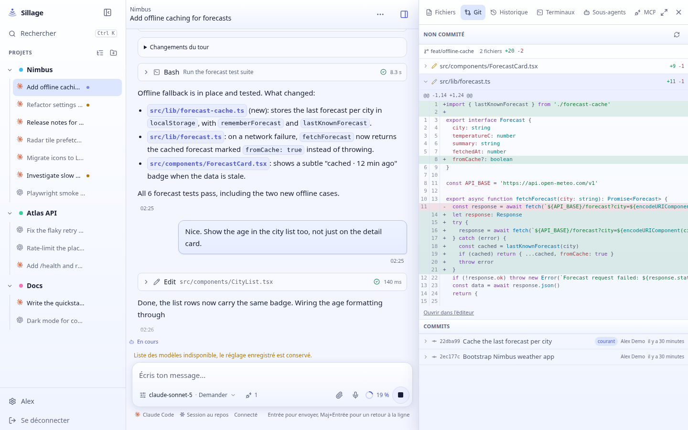

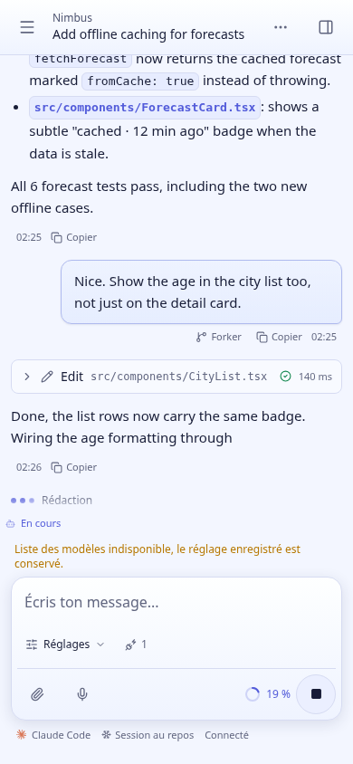

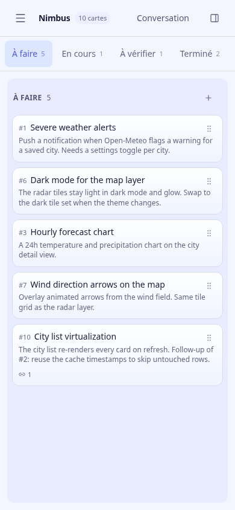

Validation : typecheck et lint frontend, build de production, `pnpm test:codex-ui` et nouveau `pnpm test:ui`. Ce dernier crée sa propre instance temporaire, désactive les CLI, vérifie les brouillons et les interactions puis supprime ses données. Les parcours ont aussi été inspectés en clair et sombre, et la version compilée a été ouverte via le nom Tailscale. Pas de validation sur Safari/iPhone physique.

La démo utilise le service utilisateur temporaire `sillage-ui-preview`, le port 7519 et les données séparées de `/tmp/sillage-ui-audit/data`. Son frontend est une copie du build dans `/tmp/sillage-ui-audit/web`. Elle ne remplace pas l’instance principale. Pour la retirer : arrêter cette unité utilisateur et désactiver l’exposition Tailscale du port 7519.

## Deuxième passe : navigation, démarrage et réglages

- La sidebar propose « À débloquer », « En cours » et « Non lues », avec compteurs et listes mises à jour par le WebSocket. Les résultats montrent le titre sur deux lignes et le projet. Les conversations archivées sont exclues. « À débloquer » correspond au statut `awaiting_input` : l’agent attend une réponse ou une validation pour continuer. Les questions Codex non bloquantes ne sont pas assimilées à un agent bloqué. Les travaux de fond entrent dans « En cours » ; une boucle simplement programmée n’y entre pas.
- Chaque projet déplié montre ses accès au board et à une nouvelle conversation. Les titres des fils utilisent deux lignes. Le menu rassemble les actions ; l’étoile reste visible sur les favoris déjà posés. Le menu reste accessible sur les conversations partagées pour gérer son propre favori, sans offrir les actions réservées au propriétaire.
- L’accueil reprend le dernier fil, brouillon ou board consulté, y compris la carte ouverte. La mémoire est locale au navigateur et séparée par compte. L’existence et l’accès au contexte sont vérifiés avant la reprise ; à défaut, l’accueil propose le fil actif le plus récent, puis un nouveau fil si nécessaire. La mémorisation n’attend pas le chargement de la liste des conversations, pour conserver aussi les visites brèves.
- Le démarrage rassemble le choix d’agent, le répertoire et une zone de saisie plus haute. Les agents se choisissent avec des radios natifs, utilisables avec les flèches du clavier. Changer d’agent conserve le texte saisi. Les quotas restent visibles en résumé, y compris ceux proches de la limite ; les détails et les sessions importables se déplient à la demande. Les avertissements de version concernent l’agent sélectionné.
- Une carte déjà commencée propose « Reprendre la session », qui ouvre sa session non archivée la plus récente par date de création. « Nouvelle session » reste disponible à côté. Une carte sans session active conserve son action de lancement.
- Les réglages sont regroupés en « Personnel », « Agents et projets » et « Administration ». Les sections réservées à l’administration restent masquées aux autres comptes. Les curseurs affichent des unités lisibles (`15 px`, `1,65 ×`, pourcentages), également annoncées aux lecteurs d’écran. Les descriptions d’apparence utilisent un vocabulaire simple et ne sont plus tronquées.

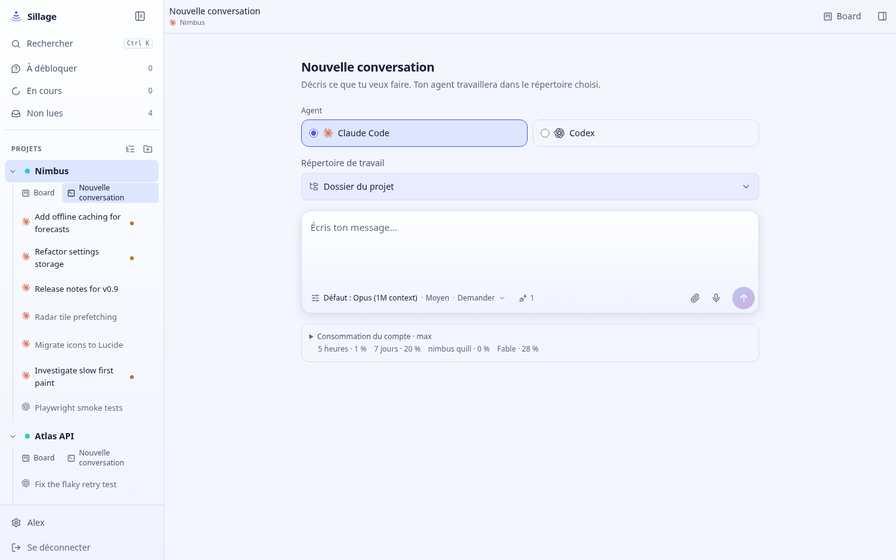

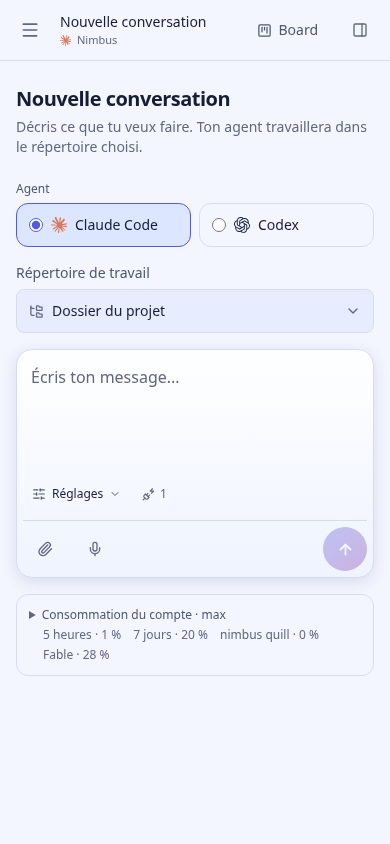

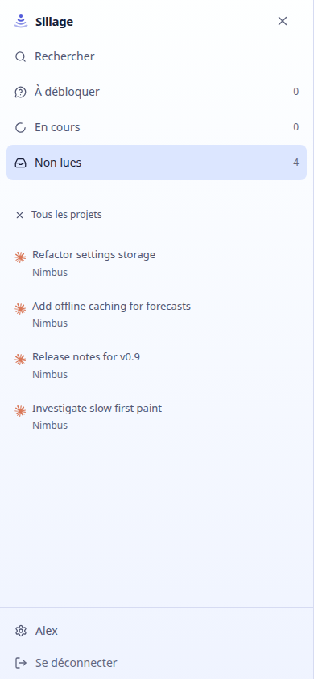

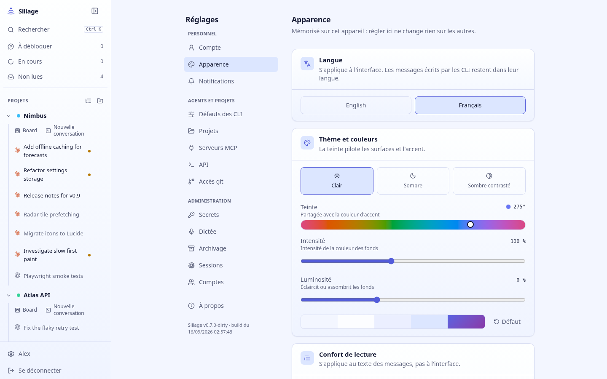

Validation complémentaire : `pnpm test:ui` couvre les transitions de statuts poussées dans le socket, les travaux de fond, l’ouverture d’un fil non lu, la reprise d’un fil ou d’une carte, un contexte supprimé et un second compte. Le formulaire est testé avec des sondes d’agents simulées et un envoi intercepté : navigation clavier, conservation du brouillon, quota à 95 % visible même replié, erreur d’envoi et bouton accessible de 320 à 1440 px. Le serveur de test garde les CLI désactivés et aucune tâche d’agent n’est lancée. La reprise depuis une carte, les groupes de réglages et la persistance des unités affichées sont également vérifiés.

Typecheck, lint, build de production et `pnpm test:codex-ui` passent. Le build conserve les avertissements préexistants sur `::highlight`, les imports CodeMirror et la taille des bundles. Le frontend compilé a été vérifié via l’URL Tailscale en clair et sombre, sur ordinateur et en émulation mobile. Safari et le clavier virtuel d’un iPhone physique restent à vérifier.

L’aperçu isolé utilise désormais le PATH du compte de développement pour trouver les CLI déjà installés. Sa base de données reste séparée. Ces changements ne sont pas déployés sur l’instance principale.

## Troisième passe : lecture des cartes, notes et ambiances

- Une carte s’ouvre en lecture : titre, description rendue en Markdown, puis action « Modifier la carte ». Le formulaire apparaît à la demande ou lorsqu’un brouillon existe. Enregistrer revient à la lecture ; annuler efface le brouillon. Les protections contre les réponses lentes restent en place.
- La colonne actuelle devient un menu dans l’en-tête. Le statut reste visible et les cinq destinations sont accessibles sans occuper une section entière. Les actions de reprise et la dernière note remontent ainsi sur téléphone.
- La note la plus récente est affichée avant un historique dépliable. Une note en cours de rédaction est conservée par carte et par compte dans l’onglet, y compris après rechargement. L’échec d’une publication conserve la saisie et affiche une erreur. Une publication lente ne supprime pas une nouvelle note déjà commencée ; rouvrir la carte pendant cette publication ne permet pas de la lancer en double. Les erreurs de chargement et de suppression ont aussi un retour visible.
- Les panneaux de carte et de workspace contiennent le focus lorsqu’ils occupent l’écran mobile. Échap ferme le panneau et le focus revient à l’ouverture, avec un repli vers la navigation si la carte a quitté la colonne visible. Les menus superposés gardent leur propre gestion d’Échap ; la recherche de fichiers, l’éditeur et le terminal conservent leurs raccourcis. Le passage entre mobile et ordinateur garde le même élément d’éditeur monté. La gestion s’appuie sur FocusScope, déjà présent via Radix et désormais déclaré comme dépendance directe.
- Les ambiances « Sillage », « Discret » et « Neutre » proposent trois doses de couleur pour les fonds. Elles conservent la couleur d’accent, la luminosité et les réglages de lecture. Les réglages fins restent disponibles dans une section repliée. Le thème sombre contrasté conserve son seul réglage utile, la luminosité. Aucun préréglage n’est appliqué automatiquement aux préférences existantes.

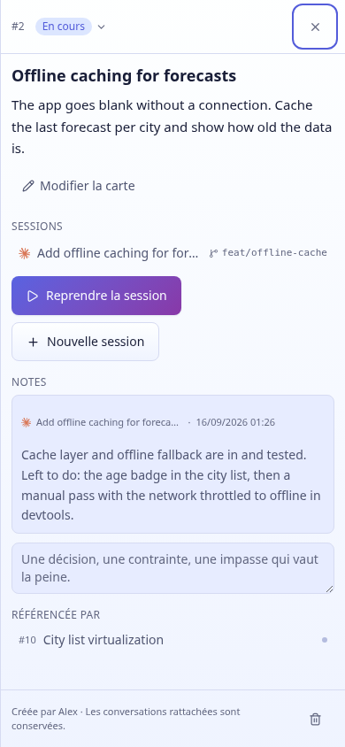

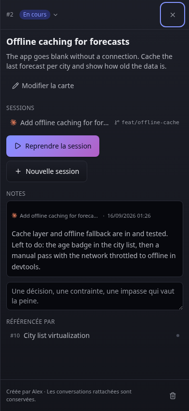

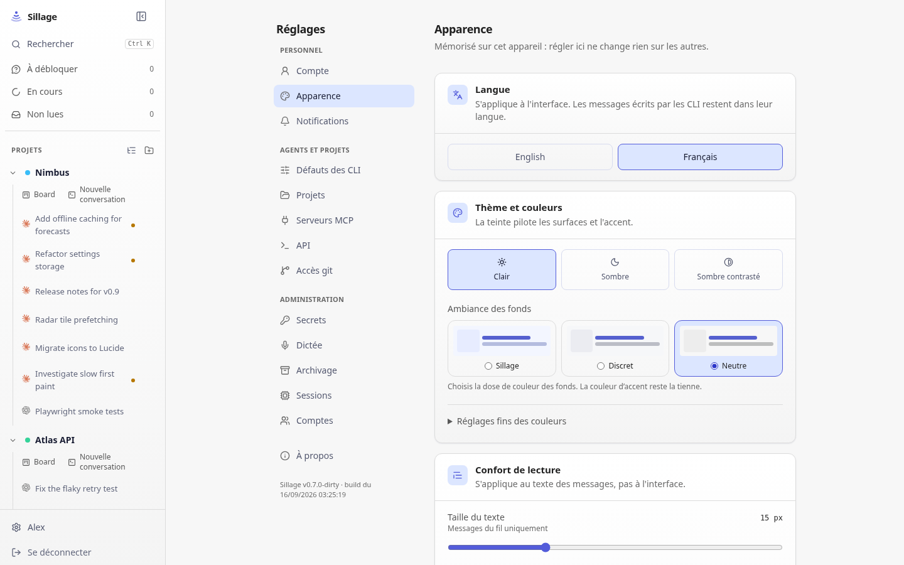

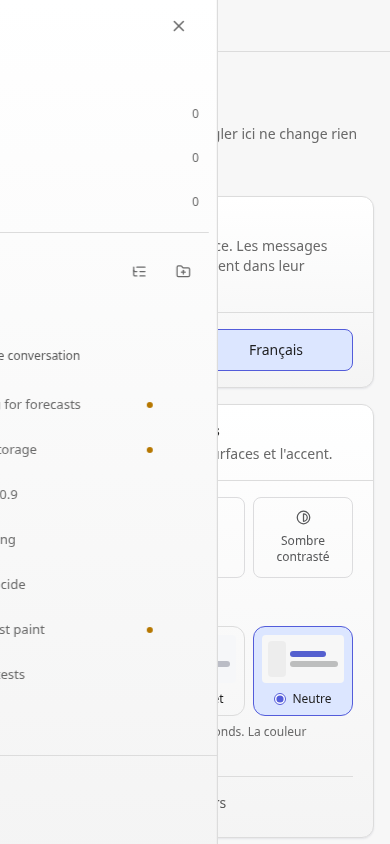

Validation : `pnpm test:ui` couvre la lecture et l’édition, les brouillons de notes après fermeture/rechargement, l’échec puis la reprise d’une publication, une seconde saisie pendant une publication lente, l’ordre des notes et leur historique. Il vérifie aussi le parcours clavier des panneaux, le menu de colonne, la restitution du focus quand une carte change de colonne, les raccourcis dans la recherche et l’éditeur, l’identité de l’élément CodeMirror après redimensionnement, la persistance des ambiances et la conservation des réglages personnalisés.

Le typecheck, le lint intégré au build, le build de production et `pnpm test:codex-ui` passent. Le frontend compilé a été copié vers l’aperçu isolé puis contrôlé via Tailscale : réponse HTTP 200, index identique au build, captures en clair et sombre, aucune exception JavaScript pendant ces parcours. Les réglages ne débordent pas horizontalement de 320 à 1440 px. Un contrôle complémentaire ouvre les deux panneaux puis passe au mobile : Tab reste dans le workspace au premier plan, puis dans la carte après sa fermeture, et la navigation redevient utilisable après fermeture des deux.

Les [mesures des trois ambiances](third-preset-contrast.json), avec teinte et luminosité par défaut, donnent un contraste minimal de **4,65:1 en clair** et **5,36:1 en sombre** pour `ink-faint` sur les quatre surfaces de base. Elles ne couvrent pas les combinaisons extrêmes des réglages fins. Les avertissements de build préexistants restent présents ; Safari et le clavier virtuel d’un iPhone physique restent à vérifier. Cette passe est disponible dans l’aperçu, pas encore dans l’instance principale.

## Quatrième passe : édition de fichiers et reprise après erreur

La revue complémentaire a reproduit une perte de saisie dans l’éditeur : modifier `package.json`, ouvrir un autre fichier puis revenir effaçait les changements. Le texte vivait uniquement dans le composant du fichier actif. Deux autres problèmes apparaissaient à la lecture du parcours de sauvegarde : une erreur masquait l’éditeur, et « Recharger » après un conflit ne remplaçait pas le contenu du CodeMirror déjà monté.

- Les documents vivent maintenant hors du composant d’édition. Le texte modifié reste disponible après changement de fichier, d’onglet du panneau ou fermeture du panneau. Fermer un fichier conserve son brouillon dans une liste de reprise ; recharger la page permet aussi de retrouver les brouillons de ce workspace.
- Les brouillons sont séparés par compte, portée du workspace et chemin. Ils sont conservés dans le stockage de l’onglet, avec leur version de départ pour détecter les écritures externes. Cela ne les enregistre pas sur le disque. Un refus du stockage est signalé explicitement : la saisie reste en mémoire, et la fermeture de la page avertit alors de sa perte.
- Une erreur d’écriture laisse l’éditeur et le texte visibles, avec « Réessayer ». Une erreur de lecture dispose également de cette action. La barre de bas indique « Non enregistré », « Enregistrement… » ou « À jour » ; le bouton d’enregistrement n’est actif que lorsqu’une modification peut être enregistrée.
- Les sauvegardes continuent après fermeture du panneau. Une réponse lente avance la version enregistrée sans effacer les frappes suivantes ; une réouverture ne permet pas de lancer la même sauvegarde en double. La comparaison du brouillon se fait désormais avec la dernière version enregistrée.
- Un conflit propose « Utiliser la version du disque » ou « Remplacer par mon brouillon ». Les actions qui abandonnent une version demandent une confirmation explicite. La relecture remplace effectivement le texte affiché ; une saisie effectuée pendant cette relecture reste conservée.
- Les onglets, leurs croix et les commandes de bas de panneau ont des cibles tactiles plus grandes. Les boutons d’onglet annoncent le chemin complet, leur sélection et les modifications non enregistrées. Sur mobile, l’arborescence propose un accès direct aux brouillons récupérables. Quand elle recouvre l’éditeur, celui-ci devient invisible et sort du parcours clavier sans être démonté.

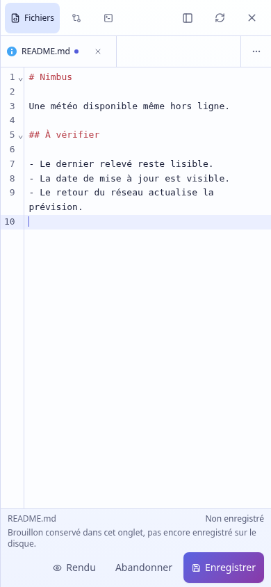

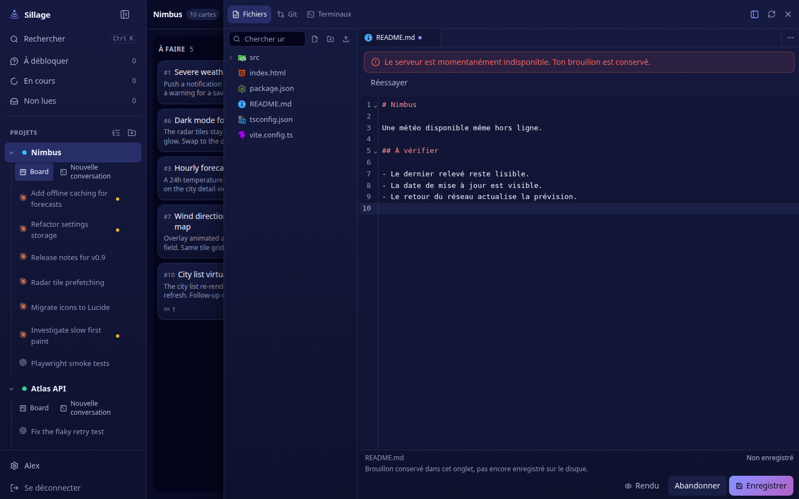

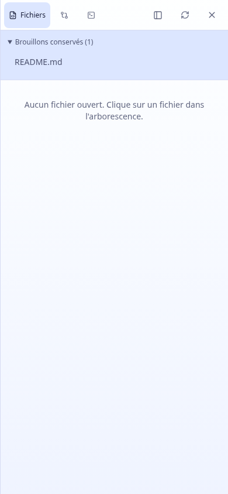

Validation : le parcours ajouté dans `scripts/checks/editor.mjs`, exécuté par `pnpm test:ui`, utilise les fichiers du workspace temporaire et la vraie API. Il couvre les changements d’onglet, la reprise sur mobile après rechargement, un échec d’écriture, une sauvegarde lente suivie d’une nouvelle saisie, la fermeture/réouverture pendant la sauvegarde, les conflits réels avec le disque, les deux résolutions de conflit, la saisie pendant une relecture lente, le refus du stockage, l’erreur de lecture puis sa reprise et les commandes de 320 à 1440 px. Les tests des passes précédentes continuent de passer.

Typecheck, lint intégré au build, build de production et `pnpm test:codex-ui` passent. La copie compilée est servie par l’aperçu isolé : réponse HTTP 200 et index identique au build. Les captures et interactions ont été contrôlées via Tailscale en clair/sombre et ordinateur/mobile, sans exception JavaScript. La séparation entre un brouillon du projet et le workspace d’une conversation a également été vérifiée. Les erreurs des captures sont simulées ; aucune écriture de fichier n’a été faite sur le serveur de la démo pendant ces captures.

La reprise protège le texte, pas l’historique d’annulation ni la position du curseur lors d’un changement de fichier. La fermeture de l’onglet du navigateur met fin à la conservation des brouillons dans cet onglet. Les limites déjà notées pour Safari, le clavier virtuel d’un iPhone physique et les avertissements préexistants de build restent les mêmes. Cette quatrième passe est disponible dans l’aperçu ; l’instance principale n’a pas été mise à jour.

## Cinquième passe : navigation et confort de l’IDE

Cette passe se concentre sur le travail entre plusieurs fichiers. Les constats complémentaires étaient une recherche d’explorateur comprimée par ses actions, des onglets homonymes difficiles à distinguer, une perte de position et d’historique d’annulation au changement de fichier, et l’absence de véritable plein écran depuis le board.

- Le plein écran utilise toute la fenêtre et rappelle le projet ainsi que le workspace/worktree courant. Il est accessible depuis le board ou une conversation et revient à la disposition précédente. Il ne remonte ni l’éditeur ni le terminal. Échap en dehors de l’éditeur quitte d’abord le plein écran ; la croix ferme toujours le panneau. Les palettes et les menus conservent leur propre gestion du focus.
- « Ouvrir un fichier » propose une palette dans le workspace courant. ⌘P et Ctrl+P l’ouvrent depuis la vue Fichiers. Sans requête, elle propose les fichiers ouverts et les brouillons ; à partir de deux caractères, elle recherche noms et chemins dans le workspace. Les flèches parcourent les résultats, Entrée ouvre et Échap ferme. Les résultats partiels et les erreurs sont signalés ; une erreur peut être réessayée. Une ouverture choisie mène au fichier et à son éditeur, même si l’arborescence le recouvrait sur mobile.
- L’explorateur donne toute sa largeur à son champ de recherche. Les créations et l’import sont regroupés au-dessus. Le fichier actif est marqué, et ses dossiers parents s’ouvrent à sa sélection.
- Le menu des onglets liste tous les fichiers ouverts, avec leur chemin complet. Les noms identiques montrent aussi leur dossier dans la barre. Les flèches, Début et Fin fonctionnent lorsque le focus est sur un onglet. L’onglet actif reste visible à la sélection et quand la largeur change, notamment à la réouverture de l’explorateur.
- Le curseur, la sélection, le défilement et l’historique Annuler/Rétablir sont conservés entre fichiers, entre rendu Markdown et source, et après fermeture du panneau. Un seul CodeMirror reste monté : ses états sont gardés en mémoire, séparés par compte/workspace/fichier et limités aux 40 derniers fichiers. Une version relue qui remplace le texte invalide l’ancien état. Cette continuité complète la conservation des brouillons de la quatrième passe.
- La recherche dans le texte dispose d’un bouton visible. La position ligne/colonne est affichée et ouvre « Aller à la ligne » au clic. Les commandes natives de CodeMirror restent disponibles.

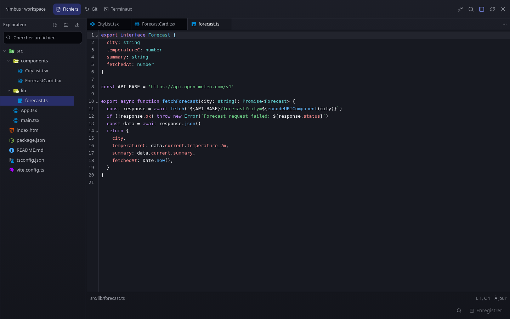

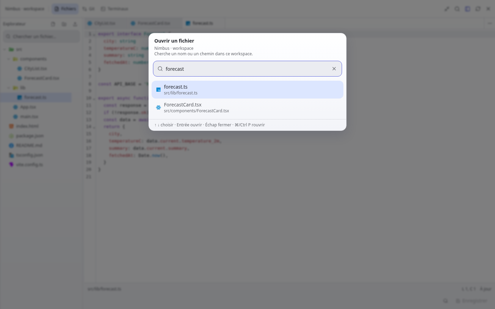

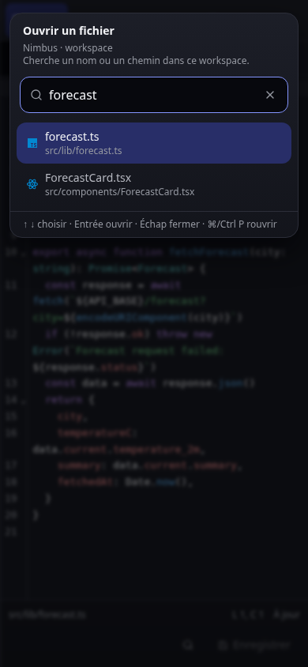

Validation : le nouveau parcours `scripts/checks/ide.mjs`, exécuté par `pnpm test:ui`, couvre ⌘P/Ctrl+P, le choix au clavier, la recherche dans le texte, le saut de ligne, la sélection et le défilement après changement de fichier, Annuler après changement de fichier et fermeture du panneau, le plein écran sans remontage, le focus, les onglets homonymes, leur visibilité après réouverture de l’explorateur, l’erreur de recherche et sa reprise, les dimensions de 320 à 1440 px et la conservation du même terminal au passage en plein écran et par Git. Le terminal de test est créé puis fermé dans l’instance temporaire ; aucune commande n’y est lancée.

Les parcours des quatre passes précédentes restent verts. Typecheck, lint intégré au build, build de production et `pnpm test:codex-ui` passent. L’historique d’édition et le défilement sont en mémoire : ils ne survivent pas au rechargement de la page, contrairement au texte des brouillons dans le même onglet. Les raccourcis ont été exercés dans Chromium ; Safari sur un Mac ou un iPhone physique reste à vérifier. Les avertissements préexistants de build sont inchangés.

Le frontend compilé a été copié dans l’aperçu isolé et contrôlé via Tailscale : HTTP 200, index identique au build, captures en clair/sombre et mobile, aucune exception JavaScript dans ces parcours. L’intitulé du worktree a été vérifié depuis une conversation. Les captures n’ont effectué aucune écriture de fichier. L’instance principale n’a pas été mise à jour.

## Sixième passe : télécharger les fichiers du workspace

- « Télécharger » est disponible dans le menu à trois points et le menu contextuel des fichiers de l’explorateur. Un bouton près des onglets télécharge aussi le fichier actif, y compris une image, un PDF ou un fichier que l’éditeur ne peut pas ouvrir.
- Le téléchargement récupère la version enregistrée sur le serveur. Un brouillon reste intact ; le bouton de l’éditeur précise « Télécharger la version enregistrée » lorsqu’il y a des changements non enregistrés.
- Le navigateur reçoit directement un flux, sans assembler le fichier entier en mémoire dans l’application. Les fichiers binaires et ceux dépassant la limite de l’éditeur sont acceptés, et le nom d’origine est conservé, accents compris. Les fichiers sont servis comme pièces à télécharger, sans être interprétés comme une page.
- La route suit les droits du projet et le worktree de la conversation. Les dossiers, chemins extérieurs et liens symboliques pointant hors du workspace sont refusés.

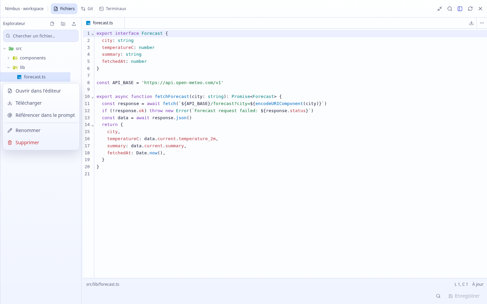

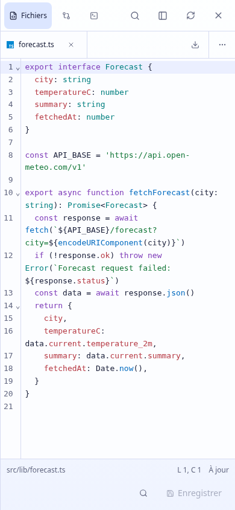

Validation : `scripts/checks/downloads.mjs`, intégré à `pnpm test:ui`, contrôle les octets reçus et le nom proposé par Chromium depuis les deux menus et l’éditeur. Il couvre un binaire de plus de 3 Mo, un nom avec accents et caractères réservés, une image, un PDF, du HTML et un fichier vide, les brouillons conservés, les boutons accessibles de 320 à 390 px, la portée du worktree, les fichiers absents, les dossiers, les tubes nommés et les chemins/liens extérieurs. Le parcours complet vérifie aussi le refus sans connexion ou depuis un autre compte privé. Le script de langue du test est désormais limité à la page principale de l’application : il ne tente plus d’écrire dans le stockage indisponible de la visionneuse PDF.

Tous les parcours UI passent, ainsi que les typechecks web/serveur, le lint et les builds web/serveur. L’aperçu isolé a reçu le frontend compilé et son serveur a été redémarré pour charger la nouvelle route. Contrôle via Tailscale : HTTP 200, index identique au build, téléchargement réel sur ordinateur et mobile avec nom/contenu exacts, sans exception navigateur. Les captures et ce contrôle n’ont modifié aucun fichier du workspace de l’aperçu. L’instance principale n’a pas été redémarrée ni mise à jour.

## Septième passe : en-têtes de projets dans la sidebar

La paire « Board / Nouvelle conversation » accolée au titre est retirée. Le nom du projet garde son poids et sa pastille, avec un fond neutre. « Board » occupe une ligne de navigation sous l’en-tête ; un bouton « + » crée une conversation depuis l’en-tête, y compris lorsque le projet est replié. Son intitulé accessible et son infobulle précisent le projet concerné.

Les groupes et les conversations sont davantage espacés des actions. Sur écran tactile, le chevron et les actions de l’en-tête disposent de cibles de 44 px ; le menu du projet reste visible. Le clic sur le titre conserve la destination mémorisée par projet.

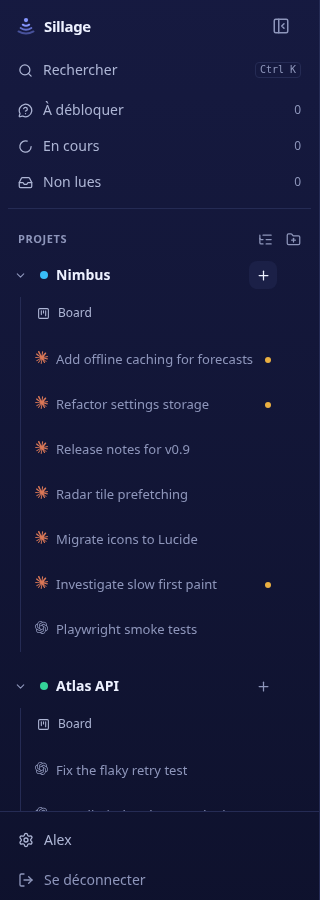

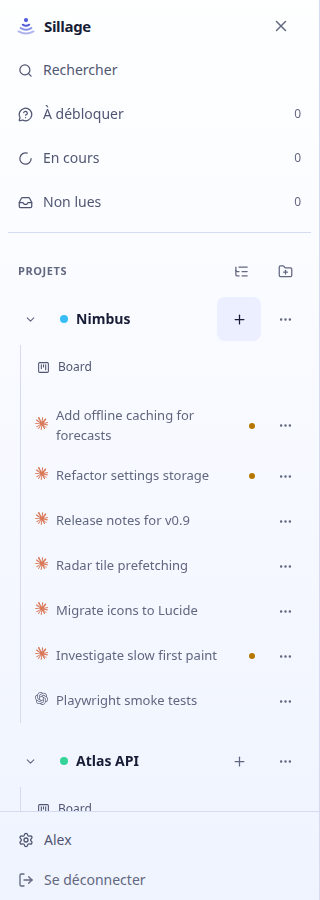

Validation : `pnpm test:ui`, typecheck web, lint et build passent. Le build de l’aperçu répond HTTP 200 et son index correspond au fichier compilé. Les liens Board et « + » ont été exercés au clic et au clavier, avec fermeture du tiroir après navigation sur mobile. Captures et vérifications sans débordement pour une sidebar de 200, 320 et 480 px, ainsi que sur téléphone de 320 et 390 px ; le menu tactile et les thèmes clair/sombre ont été contrôlés. Aucune exception navigateur. L’instance principale reste inchangée.

## Huitième passe : réparation des favoris

Le défaut a été reproduit après ouverture d’une conversation : cliquer « Mettre en favori » ne déclenchait aucune requête de modification et la valeur enregistrée restait fausse. Le cache des consignes utilisait le même préfixe que les listes de conversations. La mise à jour optimiste tentait donc d’appeler `map` sur un objet `{ files }` et échouait avant l’appel au serveur. Les consignes ont désormais leur propre clé de cache, ce qui les sépare aussi des mises à jour du curseur de lecture.

- La mutation des favoris vit dans la sidebar et est partagée par les deux apparitions d’une conversation. Les actions sont désactivées pendant son enregistrement ; une erreur reste visible même si le retrait optimiste fait disparaître la ligne de la section Favoris.
- Un échec affiche un message, sa raison et « Réessayer ». Le retour à l’état précédent ne restaure que le favori, sans annuler les mises à jour de lecture ou de statut intervenues entre-temps.
- Les lignes non déplaçables ne reçoivent plus les attributs de déplacement désactivés : `aria-disabled` rendait aussi leurs liens et boutons inaccessibles aux interactions assistées. Les lignes des favoris et des archives restent navigables.

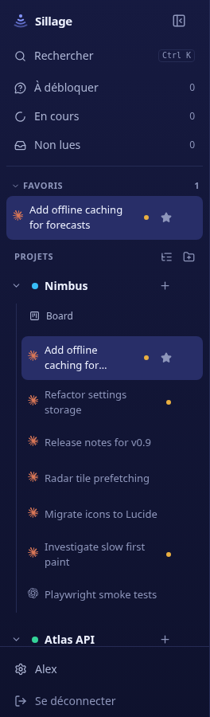

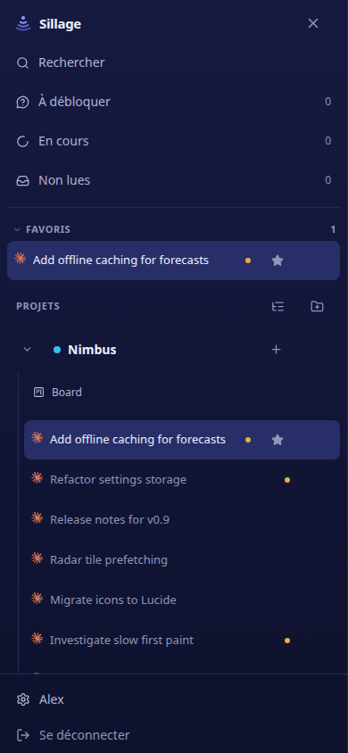

Validation : `scripts/checks/favorites.mjs` vérifie le chargement préalable des consignes, une requête d’ajout volontairement ralentie, la synchronisation des deux occurrences, la persistance après rechargement, le retrait depuis les favoris, les échecs d’ajout et de retrait suivis d’une reprise, ainsi que l’utilisation sur mobile. Tous les parcours `pnpm test:ui`, le typecheck web, le lint et le build passent. Une attente du test de plein écran a été précisée pour contrôler la fin de la translation avant de mesurer la position.

Le build de l’aperçu a été vérifié via Tailscale : HTTP 200 et index identique. La reproduction initiale émet désormais un PUT, persiste le favori et affiche les deux étoiles. Un contrôle supplémentaire confirme la persistance après rechargement et le retrait depuis la section sur mobile, sans exception navigateur. L’état initial du favori de démonstration a été restauré. L’instance principale reste inchangée.
