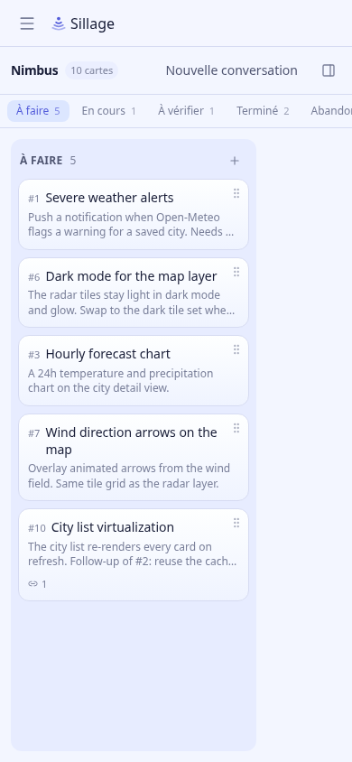
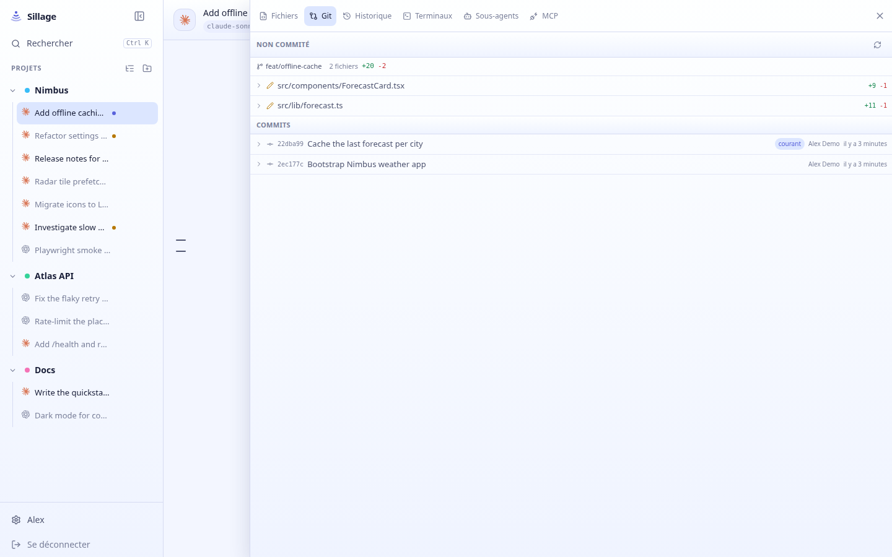
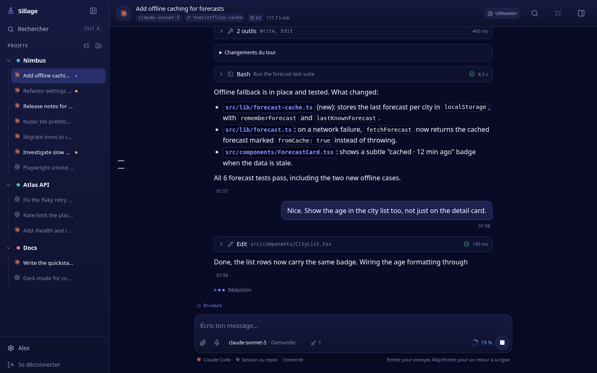
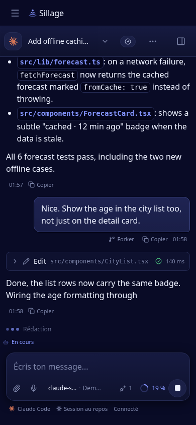
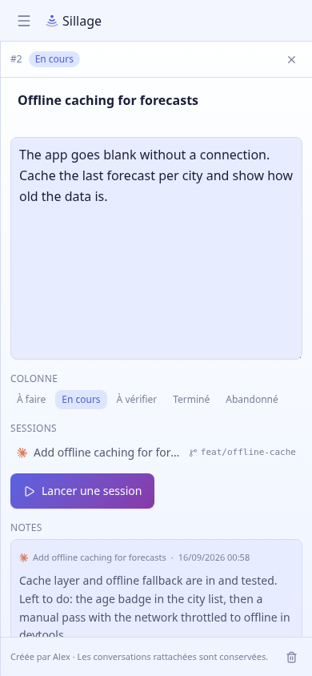
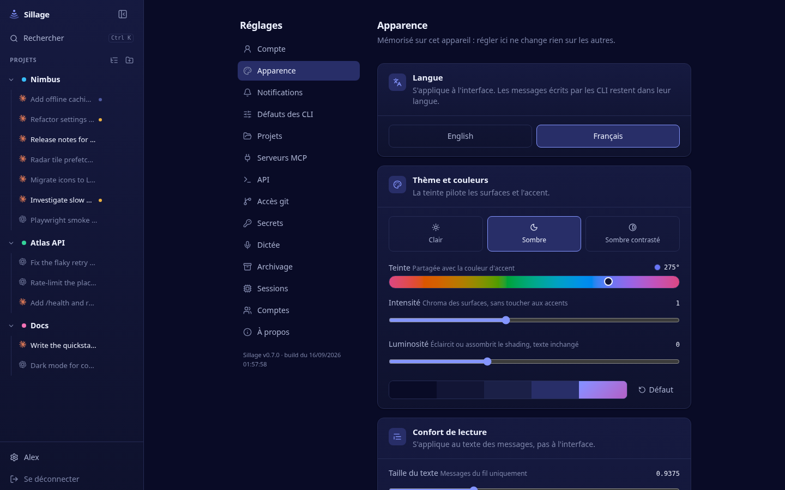

# Audit de l’interface Sillage — 16 septembre 2026

Revue globale des usages et de l’aspect visuel, sur le commit `37f6113`.

Huit passes de corrections sont réalisées : conversation et mobile ; navigation, démarrage et réglages ; lecture des cartes, notes et ambiances visuelles ; édition de fichiers et reprise après erreur ; navigation et confort de l’IDE ; téléchargement des fichiers ; en-têtes de projets ; réparation des favoris. Voir le [récapitulatif et les captures après modification](IMPLEMENTATION.md). Les constats ci-dessous décrivent l’état initial, avant ces changements.

**Diagnostic.** Sillage possède une identité cohérente et de bons composants. Le gain principal viendrait d’une meilleure hiérarchie : retrouver le travail à reprendre, comprendre ce qui attend une réponse, lire les changements avec la conversation et accéder aux commandes sur téléphone. Une refonte progressive des écrans clés me paraît plus utile qu’un changement complet de style.

**Périmètre et méthode.** Frontend compilé depuis les sources actuelles, instance de démonstration séparée et données du seeder du dépôt. Parcours conversation, autorisation, nouvelle conversation, board, détail de carte, apparence, navigation et panneau de travail. Captures en 1440 × 900 et 390 × 844, thèmes clair et sombre. Interactions vérifiées avec Chromium/Playwright, dont le clavier, les réglages du message et la fermeture d’une carte modifiée. Le constat initial a été établi sans modifier le code applicatif ni les données de l’instance principale.

Les 24 captures principales ne présentent ni exception JavaScript ni débordement horizontal du document. Cela ne garantit pas que chaque conteneur ou chaque interaction soit correct. Le clavier virtuel et Safari sur un véritable iPhone n’ont pas été testés. Les échanges des agents sont des fixtures : les noms de modèles et certaines combinaisons d’états ne permettent pas de conclure à un bug du fonctionnement réel des agents.

**Ce qui mérite d’être conservé.** Les tokens de thème centralisés, les deux thèmes, la largeur de lecture contenue, les groupes d’outils repliables, les demandes d’autorisation dans le fil, la palette de recherche et les liens entre cartes, conversations et fichiers. Les réglages du message disposent déjà d’une feuille adaptée au mobile. La sidebar peut déjà être redimensionnée et afficher davantage de métriques : les recommandations ci-dessous portent sur le contenu prioritaire et les valeurs par défaut.

| Priorité | Chantier | Bénéfice | Ampleur indicative |
| --- | --- | --- | --- |
| P1 | Préserver les modifications d’une carte | Éviter une perte de saisie | Petite à moyenne |
| P1 | Focus de la navigation fermée | Rendre le parcours clavier utilisable | Petite à moyenne |
| P1 | Contraste des textes secondaires | Améliorer la lecture dans toute l’application | Petite, validation transversale |
| P1 | Board mobile et cibles tactiles | Utiliser la largeur disponible et faciliter les gestes | Petite à moyenne |
| P2 | Conversation et changements côte à côte | Relire le travail sans perdre son contexte | Moyenne à importante |
| P2 | Navigation orientée vers le travail à reprendre | Retrouver les conversations importantes | Moyenne |
| P2 | En-tête et saisie sur mobile | Récupérer de la place et rendre les commandes lisibles | Moyenne |
| P2 | Nouvelle conversation et détail de carte | Mettre l’intention et la reprise au premier plan | Moyenne |
| P3 | Typographie, surfaces et réglages | Renforcer la hiérarchie et simplifier les préférences | Moyenne |

Les ampleurs sont des estimations de périmètre, pas des engagements de délai.

**1. Préserver la saisie d’une carte.**

Constat reproduit : modifier la description, fermer avec la croix et rouvrir la carte fait disparaître le brouillon. Les boutons Enregistrer/Annuler existent, mais la fermeture les contourne. Le changement de carte mérite la même protection.

Préférer un brouillon conservé par carte, ou une confirmation uniquement lorsqu’une saisie serait perdue. Une sauvegarde automatique est aussi possible, mais demande des états explicites « Enregistrement », « Enregistré » et « Échec » ; elle élargit le chantier.

Validation attendue : fermer puis rouvrir conserve la saisie, ou avertit avant sa perte ; un échec de sauvegarde ne fait pas disparaître le texte.

Source : `apps/web/src/components/board/CardPanel.tsx`, état local et fermeture directe, lignes 59–96.

**2. Retirer la navigation invisible du parcours clavier.**

Sur la vue mobile, après placement du focus sur le document, les premières tabulations atteignent « Fermer la navigation », Rechercher et les projets alors que le tiroir est fermé. Les éléments focalisés ont des coordonnées horizontales négatives. Le tiroir est translaté hors écran mais reste interactif.

Rendre le tiroir inerte lorsqu’il est fermé, avec une logique adaptée à la sidebar visible sur ordinateur. À l’ouverture mobile, gérer le focus dans le tiroir et le restituer au bouton d’ouverture à la fermeture. Vérifier également la sidebar masquée sur ordinateur et les panneaux superposés.

Source : `apps/web/src/components/AppShell.tsx`, ligne 212.

**3. Corriger le contraste des textes secondaires avant d’affiner la palette.**

Le token `--sg-ink-faint` sert à des contenus utiles : descriptions des cartes, titres de conversations lues et indications de réglages. Dans le thème clair par défaut, ses rapports de contraste calculés depuis les couleurs résolues sont d’environ **3,36:1 à 3,89:1** sur les quatre surfaces de base. Le seuil de référence est **4,5:1 pour le texte courant**, sous réserve des exceptions définies par le [W3C](https://www.w3.org/WAI/WCAG22/Understanding/contrast-minimum).

Assombrir ce token en clair et réserver les tons plus faibles aux éléments réellement accessoires. Les descriptions utiles peuvent prendre `ink-soft`. Le sombre est meilleur sur les surfaces principales ; le couple `ink-faint` / `surface-high` atteint toutefois seulement environ 4,43:1.

Ces mesures concernent les tokens par défaut convertis en sRGB, pas chaque pixel des dégradés ni toutes les combinaisons offertes par les curseurs. Les variations de thème devront être vérifiées après correction.

Sources : `apps/web/src/styles/tokens.css`, lignes 50 et 109 ; `apps/web/src/components/board/CardTile.tsx`, ligne 50.

**4. Faire réellement profiter le board de la largeur du téléphone.**

À 390 px, le board montre une seule colonne mais la garde à **272 px**, pour environ **366 px disponibles après les marges**. Presque un quart de l’espace utile reste vide. Les titres et descriptions sont donc coupés plus tôt que nécessaire.

Utiliser toute la largeur disponible sur mobile, conserver les colonnes fixes sur ordinateur et rendre les onglets de statut plus confortables. Sur ordinateur, les cinq colonnes dépassent la largeur d’un écran de 1440 px avec la sidebar ouverte : c’est un choix acceptable pour un kanban, mais les colonnes terminées pourraient être repliées par défaut ou mémoriser leur repli. Le contrôle existe déjà.

Les poignées de déplacement mesurent **18 × 18 px**, les boutons joindre/dicter **28 × 28 px**, les onglets de statut **24 px de haut**. Viser 44 px pour les commandes fréquentes au doigt, sans nécessairement agrandir leur icône. Le minimum WCAG AA est de 24 × 24 px avec des exceptions, notamment d’espacement : une dimension seule ne suffit donc pas à déclarer une non-conformité. Voir les critères [minimum](https://www.w3.org/WAI/WCAG22/Understanding/target-size-minimum) et [renforcé](https://www.w3.org/WAI/WCAG22/Understanding/target-size-enhanced).

Sources : `apps/web/src/routes/BoardPage.tsx`, lignes 270 et 378 ; `apps/web/src/components/board/CardTile.tsx`, ligne 120 ; `apps/web/src/components/ui/Button.tsx`.

**5. Offrir une vraie disposition de relecture sur ordinateur.**

Le panneau de travail s’ouvre au-dessus de la conversation. Sa largeur par défaut vaut 72 % de la fenêtre, plafonnée à 1040 px : à 1440 px, il occupe environ **1037 px**. La conversation est presque entièrement masquée, même lorsque l’on veut simplement consulter deux fichiers modifiés.

Ce comportement est explicitement voulu dans le code pour donner de la place à l’explorateur et à l’éditeur. Je proposerais de conserver cette vue agrandie et d’ajouter une disposition « côte à côte » pour la relecture : conversation à gauche, diff ou fichier à droite, séparation ajustable et préférence mémorisée. Sur une largeur insuffisante, revenir à une vue unique. Le panneau plein écran reste adapté au mobile.

Validation attendue : lire un diff et répondre à l’agent sans fermer le panneau ni perdre la position dans le fil.

Sources : `apps/web/src/lib/panel.ts`, ligne 39 ; `apps/web/src/components/panel/SidePanel.tsx`, ligne 137.

**6. Orienter la navigation vers ce qui demande de l’attention.**

La sidebar représente bien les projets, mais à sa largeur initiale de 264 px, beaucoup de titres sont réduits à quelques mots. Les états sont surtout des petites pastilles. Le mode détaillé ajoute des métriques techniques, sans résoudre entièrement la reconnaissance du sujet. L’accueil `/` redirige vers un nouveau fil du premier projet, même quand des conversations existent.

Ajouter des accès filtrés « À répondre », « En cours », « Non lues » au-dessus des projets, sans dupliquer une longue liste complète. Donner deux lignes aux titres importants ou un affichage confortable optionnel, avec un état textuel dans les vues qui servent au suivi. Ouvrir le dernier contexte utilisé, ou une courte vue de reprise si plusieurs tâches attendent une réponse.

Rendre les destinations « Conversations » et « Board » explicites dans le contexte du projet. Actuellement, cliquer le projet peut ouvrir l’un ou l’autre selon la vue mémorisée : cette mémoire est utile, mais gagnerait à être accompagnée de repères visibles.

Sources : `apps/web/src/routes/HomePage.tsx`, ligne 14 ; `apps/web/src/components/AppShell.tsx`, lignes 934–987 ; `apps/web/src/lib/project-view.ts`.

**7. Recomposer l’en-tête et la saisie pour le téléphone.**

Le téléphone affiche une barre « Sillage », puis une seconde barre de conversation. Dans la capture, elles prennent ensemble environ **112 px**. Malgré cela, le titre est tronqué et le projet n’est pas visible directement. En bas, le nom du modèle et le mode peuvent devenir « claude-s… » et « Dem… ». Le chevron qui permet de découvrir les réglages est masqué au repos.

Composer un en-tête contextuel unique avec accès à la navigation, projet, titre et menu secondaire. Présenter sous la saisie un bouton identifiable « Réglages » ou « Modèle · mode » qui ouvre la feuille déjà existante. Garder visibles les états qui changent la décision de l’utilisateur, notamment une permission moins restrictive. Joindre, dicter et envoyer doivent rester faciles à viser.

Clarifier également la distinction entre l’activité précise (« Rédaction ») et l’état global (« En cours »), actuellement visibles à quelques pixels de distance. Les détails de liaison et de session peuvent passer dans une vue secondaire lorsqu’ils sont normaux.

Sources : `apps/web/src/components/AppShell.tsx`, ligne 289 ; `apps/web/src/routes/ConversationPage.tsx`, ligne 861 ; `apps/web/src/components/chat/ComposerSettings.tsx`, ligne 175 ; `apps/web/src/components/chat/ComposerStatus.tsx`.

**8. Donner la priorité à l’intention sur les écrans de lancement et de reprise.**

La nouvelle conversation empile le titre, une explication de sa création, deux grandes cartes de CLI, les quotas et le répertoire de travail, alors que la saisie est séparée en bas. Sur téléphone, le contexte de travail se retrouve bas dans le défilement. Les quotas ont leur utilité avant de lancer une tâche : conserver un résumé visible, puis déplier le détail à la demande.

Proposition : un bloc principal « Que veux-tu faire sur Nimbus ? », puis un résumé compact et modifiable de l’agent, du modèle et du répertoire. Reprendre les derniers choix pertinents, garder les alertes importantes et rendre le détail des quotas et des options accessible sans occuper l’essentiel de la page.

Le détail de carte possède une autre occasion de gagner de la place : la description est toujours un champ de dix lignes, même pour trois lignes de texte. La note de session utile à la reprise descend sous ce grand champ.

Afficher une description lisible à hauteur naturelle avec action Modifier, faire remonter la dernière note et la session associée. Mettre « Ouvrir la session » en premier lorsqu’une session pertinente existe, tout en conservant « Nouvelle session » comme action distincte.

Sources : `apps/web/src/routes/DraftConversationPage.tsx`, ligne 293 et suivantes ; `apps/web/src/components/board/CardPanel.tsx`, ligne 112.

**9. Affiner le langage visuel et les réglages.**

Il s’agit ici de propositions esthétiques, pas de bugs. Le violet donne une identité reconnaissable, mais teinte simultanément le fond, les cartes, les colonnes, les sélections et les contrôles. Des surfaces un peu plus neutres laisseraient davantage de poids aux sélections et aux actions. Conserver la personnalisation existante.

Rendre les niveaux typographiques plus nets : titre de page, titre de section, contenu et métadonnées. Réserver les textes de 10–11 px aux informations vraiment secondaires et utiliser une taille plus confortable pour les titres de conversations, descriptions et commandes courantes. La bonne largeur du texte des conversations mérite d’être gardée.

Les quatorze rubriques de réglages de l’administrateur forment une liste plate. Les regrouper visuellement en préférences personnelles, agents/projets et administration réduirait la recherche. Dans Apparence, afficher « 15 px » plutôt que « 0.9375 » pour la taille du texte ; remplacer les notions de « chroma » et « shading » par des formulations compréhensibles sans connaissance des tokens. Quelques préréglages, puis les curseurs avancés, offriraient un meilleur point d’entrée.

Sources : `apps/web/src/routes/SettingsPage.tsx`, ligne 47 ; `apps/web/src/components/AppearanceControls.tsx`, ligne 122 ; `apps/web/src/styles/tokens.css`.

**Ordre de réalisation conseillé.** D’abord corriger la perte de saisie, le focus invisible, les contrastes et la largeur du board mobile. Ensuite prototyper la conversation sur ordinateur et téléphone, car elle concentre le plus d’usage : navigation, en-tête, saisie et relecture des changements. Enfin appliquer les règles retenues aux cartes, à la nouvelle conversation et aux réglages.

Avant de généraliser la refonte, vérifier quatre tâches simples : retrouver une conversation qui attend une réponse, lancer un message avec les bons réglages, consulter un diff tout en gardant le fil visible sur ordinateur et reprendre une carte depuis sa dernière note. Ces parcours serviront mieux la décision qu’une comparaison de palettes seule.
