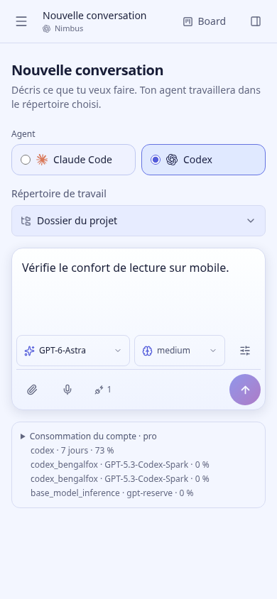
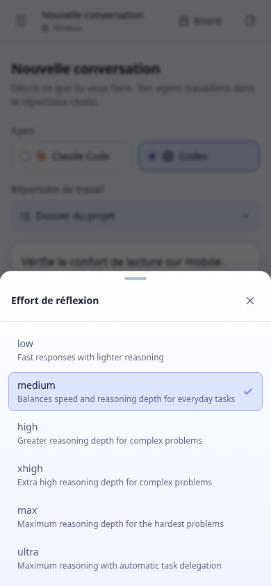
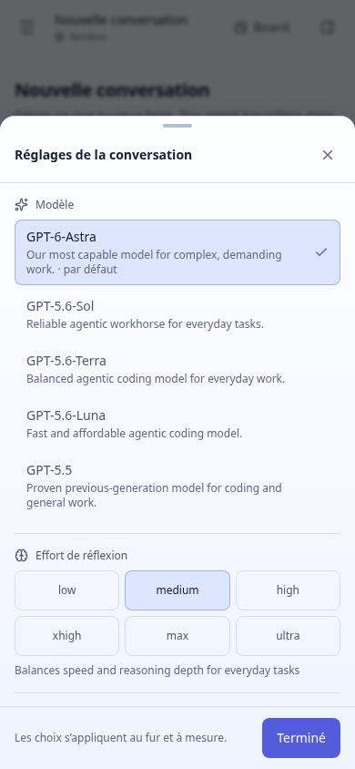
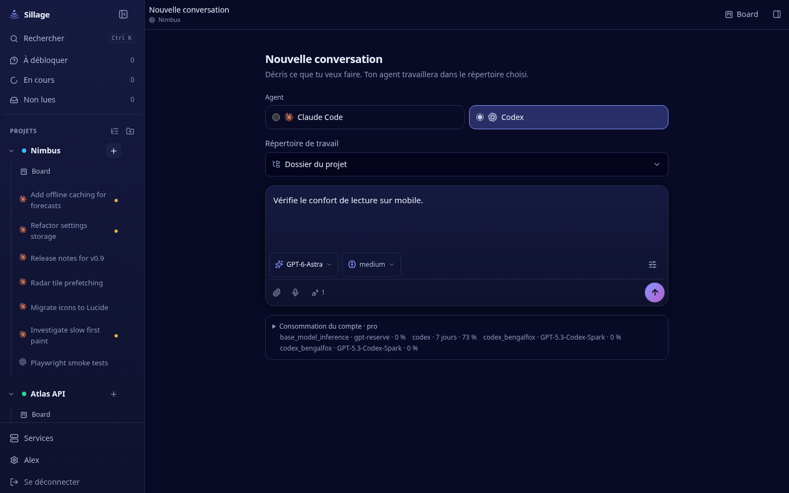
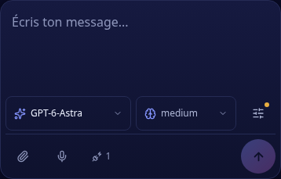
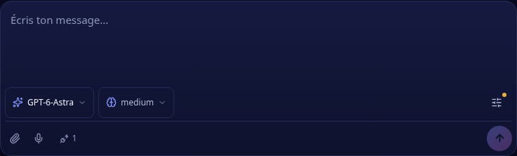

# Intégration des réglages du composer

La proposition a été retenue le 17 septembre 2026. L’utilisateur change surtout le modèle et l’effort ; ces deux réglages ont chacun un accès direct, avec leur valeur lisible sur mobile. Le choix se fait en deux interactions. La vue complète reste ouverte entre les modifications et présente les options sans sous-écrans, puis les contrôles MCP.

[Essayer la version intégrée via Tailscale](http://marldev.tail710c78.ts.net:7521/) — compte de démonstration `alex`, mot de passe `sillage-demo`.

Le catalogue, les niveaux disponibles et les replis continuent de venir de `useAgentSettings`. Les valeurs enregistrées hors catalogue restent lisibles. La recherche apparaît au-delà de huit modèles. Un modèle sans effort masque le raccourci correspondant ; le changement de modèle conserve ou adapte l’effort selon ses capacités. Les permissions propres à Claude et Codex, les indications de configuration encore en vigueur et l’inventaire MCP externe sont conservés.

Les permissions étendues et le mode Plan sont signalés par un petit point sur le bouton des réglages, sans rangée supplémentaire sous le modèle et l’effort. Le détail reste disponible dans le panneau, au survol et dans le libellé accessible du bouton.

Sur téléphone, les feuilles suivent la hauteur du viewport visuel, y compris lorsque le clavier la réduit. Les raccourcis et options ont une hauteur minimale de 44 px. Fermer restitue le focus au déclencheur ; sur ordinateur, un choix à la souris reprend une saisie déjà commencée au même curseur. Flèches, Début et Fin parcourent les options ; Entrée ou Espace choisit et Échap ferme.

## Changements rapides et sauvegarde

Le parcours précédent attendait une relecture de la conversation avant d’afficher la nouvelle configuration. Deux changements rapides pouvaient ainsi repartir de la même ancienne configuration et s’écraser. `useConversationConfig` affiche immédiatement le choix et ordonne les écritures par conversation, même si l’utilisateur change de page. Les réponses anciennes ne remplacent pas les choix récents.

Envoyer, infléchir et exécuter une commande native depuis le composer attendent l’enregistrement des réglages. Un échec conserve les choix et la saisie, avec une action « Réessayer » disponible dans le composer et dans le panneau complet. Une configuration dont l’enregistrement a échoué ne déclenche pas l’envoi du message.

## Validation

- `pnpm test:composer-ui` : vrais composants et vraie file de sauvegarde, API simulée, aucun agent lancé. Vérifie les deux accès directs, les modifications multiples, une réponse lente, l’ordre des écritures, l’attente avant envoi, les erreurs puis la reprise, la conservation du brouillon, les règles propres aux agents et les MCP. Vérifie également un catalogue long, un modèle sauvegardé hors catalogue, une approbation granulaire non modifiable, un changement de conversation pendant la sauvegarde, le focus, le changement de taille et le viewport réduit par le clavier.
- Dimensions exercées : 1440 × 900, 390 × 844, 320 × 640 et 667 × 375. Pas de débordement horizontal ni d’exception navigateur dans ces parcours.
- Les permissions étendues et le mode Plan n’augmentent plus la hauteur du composer ; leur détail reste annoncé par le bouton des réglages. Vérifié également sur l’aperçu compilé à 390 et 1440 px.
- `pnpm test:ui` et `pnpm test:codex-ui` passent, ainsi que le typecheck et le lint web.
- Build de production dans `/tmp/sillage-composer-app/web`. Les avertissements déjà présents sur `::highlight`, CodeMirror et la taille des bundles restent présents.
- Aperçu compilé contrôlé avec le vrai catalogue, en clair et sombre. Les interactions de cette vérification visuelle restent dans une nouvelle conversation non envoyée. HTTP 200 et index servi identique au build.

Le clavier et Safari sur un iPhone physique restent à essayer. La simulation du viewport ne remplace pas ce contrôle.

## Aperçu

L’unité utilisateur `sillage-composer-app-preview` sert le frontend compilé sur `127.0.0.1:7521` via Vite preview. Son API et ses WebSockets sont dirigés vers l’instance de démonstration existante sur le port 7519, avec sa base séparée. La maquette initiale reste sur le port 7520.

L’interface compacte a été déployée sur l’instance principale le 17 septembre 2026 à 02:53 (Paris), sans redémarrage du serveur. Le build testé remplace atomiquement le dossier web ; les anciens assets restent disponibles pour les onglets ouverts. Les 40 fichiers contrôlés via l’URL publique correspondent au build, et le PID du serveur est inchangé. La provenance et le dossier de retour arrière sont consignés dans `~/.local/share/sillage/app/deployed-composer-web.json`.

Pour retirer cet aperçu :

```sh
systemctl --user stop sillage-composer-app-preview
sudo tailscale serve --http=7521 off
```












