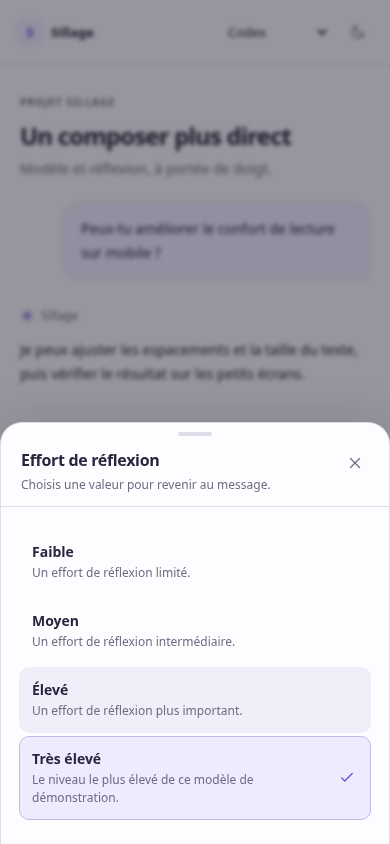
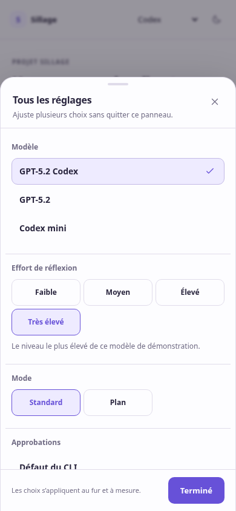
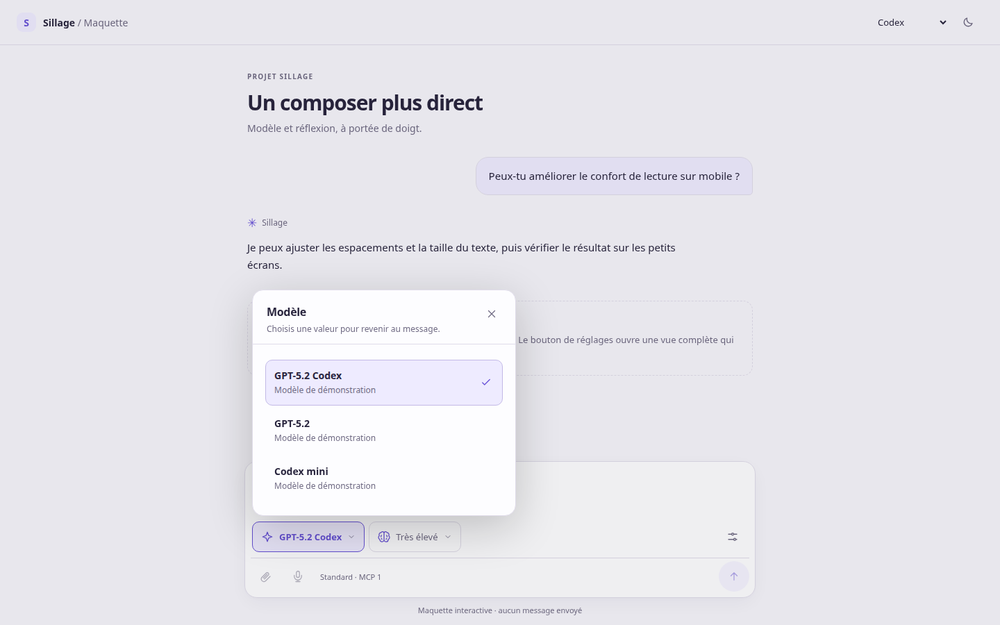

# Proposition pour les réglages du composer

Maquette autonome du 17 septembre 2026, préparée après consultation du composer actuel. L’utilisateur a indiqué changer surtout **le modèle et l’effort de réflexion**. Après validation de la proposition, cette interaction a été intégrée au frontend : voir le [compte rendu d’intégration](IMPLEMENTATION.md).

[Ouvrir la maquette privée, via Tailscale](http://marldev.tail710c78.ts.net:7520/).

## Interaction proposée

- Deux boutons montrent en permanence le modèle et l’effort sous le message, également sur téléphone. Toucher le bouton ouvre directement ses valeurs ; choisir applique la valeur et ferme. **Deux interactions au lieu de trois** pour chaque réglage, quatre au lieu de six pour changer successivement les deux.
- Le bouton « Tous les réglages » ouvre une vue sans sous-écrans, qui reste ouverte pendant les changements : modèle, effort, mode et permissions propres à l’agent, puis MCP. Les modifications s’appliquent à chaque choix ; « Terminé » ferme simplement le panneau.
- Sur téléphone, les sélecteurs prennent la forme d’une feuille en bas de l’écran. Les commandes ont une cible d’au moins 44 px ; les deux raccourcis restent visibles sans défilement horizontal. Le contenu long du panneau défile entre un en-tête et un pied fixes.
- Sur ordinateur, le panneau s’ancre au bouton. Les flèches parcourent les choix, Entrée ou Espace sélectionne, Échap ferme.
- Le texte saisi reste présent. Sur téléphone, fermer un panneau restitue le focus au bouton pour éviter de faire surgir le clavier ; sur ordinateur, une saisie déjà commencée reprend au même endroit.
- Les états « Plan », « Accès total », « Approbations : jamais » et « Tout autoriser » restent lisibles dans le composer lorsqu’ils sont sélectionnés.








## Portée de la maquette

`index.html`, `prototype.css` et `prototype.js` fonctionnent sans dépendance. Les modèles, niveaux et serveurs MCP sont illustratifs. Les choix vivent uniquement en mémoire dans cette page ; aucune requête ne part vers une API Sillage ou un agent. L’envoi, les pièces jointes et la dictée sont désactivés. Le menu d’agent et le changement de thème permettent de comparer les rendus.

Pour l’intégration, conserver les données et règles de `useAgentSettings` dans `apps/web/src/components/chat/agent-settings.tsx` : catalogue réel, niveaux disponibles, repli de l’effort au changement de modèle, valeurs enregistrées et différence entre configuration choisie et appliquée. Les accès rapides viendraient dans `ComposerSettings.tsx`, et le panneau à deux étages de `SettingsPanel.tsx` deviendrait une vue à plat. Les permissions de Claude et celles de Codex gardent leurs différences. L’inventaire MCP conserve aussi la distinction entre serveurs gérés par Sillage et serveurs externes.

## Vérification

Parcours Playwright dans Chromium, sur ordinateur à 1440 px et en émulation mobile à 390 et 320 px : choix rapides et fermeture, modifications successives dans le panneau complet, adaptation des niveaux au modèle, disparition du réglage sans effet, brouillon conservé, états de permissions visibles, thèmes clair/sombre et absence de débordement horizontal. Les boutons rapides mesurent au moins 44 × 44 px. Un contrôle complémentaire couvre les flèches, Entrée, Échap, Tab et Maj+Tab, la sélection du texte conservée sur ordinateur, le retour du focus et la disposition en paysage à 667 × 375 px. Aucune exception JavaScript sur ces parcours.

Safari sur un iPhone physique et son clavier virtuel restent à essayer. Cette validation concerne la maquette ; elle ne valide pas encore son intégration aux mises à jour réelles de configuration.

## Service d’aperçu

Unité utilisateur temporaire `sillage-composer-preview`, serveur Python lié à `127.0.0.1:7520`, racine limitée à ce dossier. L’exposition Tailscale est privée. La réponse HTTP et le contenu servi ont été contrôlés avec `curl` et `cmp`.

Pour retirer l’aperçu :

```sh
systemctl --user stop sillage-composer-preview
sudo tailscale serve --http=7520 off
```
